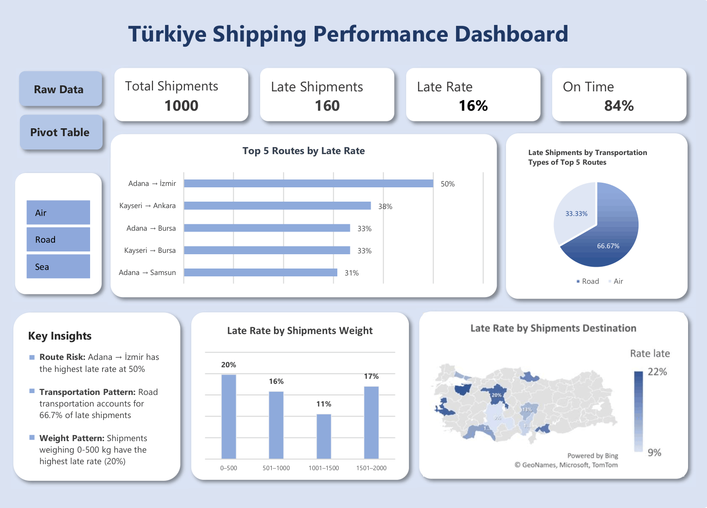

# Türkiye Shipping Performance Dashboard

## Project Overview

An Excel-based dashboard designed to analyze shipping performance across routes, transportation types, shipment weights, and customer segments in Türkiye.

The project uses shipment-level data to identify patterns in delivery delays and highlight areas that may require operational attention.

## Objective

The objective of this project is to:

- Evaluate overall shipping performance
- Identify routes with high late-shipment rates
- Compare delivery performance across transportation types
- Analyze late rates by shipment weight
- Examine differences in performance across customer segments
- Present findings through an interactive Excel dashboard

## Dataset

- Total shipments: 1,000
- Location: Türkiye
- Unit of analysis: Individual shipment
- Key variables include:
  - Origin and destination cities
  - Transportation type
  - Shipment weight
  - Distance
  - Customer segment
  - On-time delivery status

## Tools & Techniques

- Microsoft Excel
- Excel Tables
- PivotTables
- PivotCharts
- Slicers
- Data validation
- Calculated fields
- Data visualization

## Dashboard



## Key Findings

- The overall late-shipment rate is **16%**, with **84% of shipments delivered on time**.
- **Adana → İzmir** has the highest late rate among the top five routes at **50%**.
- **Road transportation accounts for 66.7% of late shipments** among the top five late-rate routes.
- Shipments weighing **0–500 kg** have the highest late rate among the weight categories at **20%**.
- **Individual shipments have a higher late rate (17%) than Corporate shipments (13%)**.

## Project Structure

```text
├── README.md
├── Turkiye_Shipping_Performance_Dashboard.xlsx
└── dashboard-preview.png
